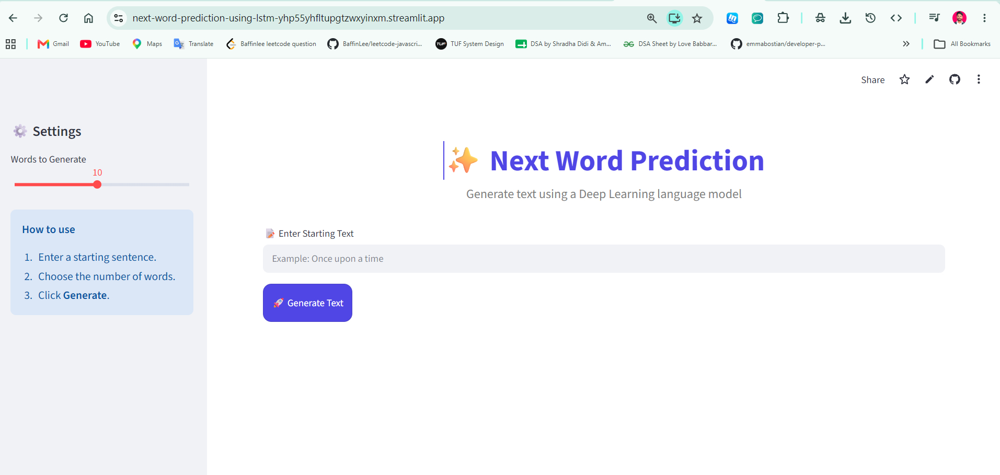
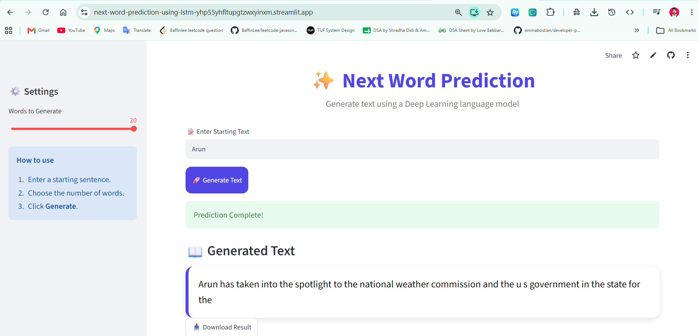

# ✨ Next Word Prediction (Deep Learning) using LSTM 

Built an end-to-end  **LSTM Next Word Prediction** model predicts the next word using recurrent neural networks. However, building an LSTM next-word predictor is an excellent project for understanding how language models evolved.

## Resources I used
Dataset Name: **News Category Dataset**
> Link: https://www.kaggle.com/datasets/rmisra/news-category-dataset

## 📖 Overview

This project demonstrates a **Next Word Prediction** model that generates text based on a user-provided starting phrase. The application uses a trained neural network and a tokenizer to predict one word at a time, allowing users to generate complete sentences interactively.

The web interface is built with **Streamlit**, making the model easy to use without writing any code.

---

## 📸 Screenshot

### Home:




### Work:




---

## 🚀 Features

- Predicts the next words from a given input sentence.
- Interactive Streamlit web interface.
- Adjustable number of generated words.
- Fast inference using a pre-trained TensorFlow model.
- Clean and responsive UI.
- Download generated text.

---

## 🛠️ Technologies Used

- Python
- TensorFlow / Keras
- NumPy
- Streamlit
- Pickle

---

## 📁 Project Structure

```
Next-Word-Prediction/
│
├── app.py
├── README.md
├── requirements.txt
│
├── models/
│   ├── next_word_model.h5
│   └── tokenizer.pkl
│
└── notebooks/
    └── next_word_prediction.ipynb
```

---

## ⚙️ Installation

### 1. Clone the repository

```bash
git clone https://github.com/Arun-Jawlia/Next-Word-Prediction-Using-LSTM

cd Next-Word-Prediction
```

### 2. Create a virtual environment (Optional)

**Windows**

```bash
python -m venv venv

venv\Scripts\activate
```

**Linux / macOS**

```bash
python3 -m venv venv

source venv/bin/activate
```

### 3. Install dependencies

```bash
pip install -r requirements.txt
```

---

## ▶️ Run the Application

```bash
streamlit run app.py
```

The application will open in your browser at:

```
http://localhost:8501
```

---

## 💻 Usage

1. Enter a starting sentence.
2. Select the number of words to generate.
3. Click **Generate**.
4. View the generated text.
5. Download the generated result if desired.

---

## 🧠 Model Information

- Framework: TensorFlow/Keras
- Input: Tokenized text sequence
- Output: Predicted next word
- Sequence Padding: Pre-padding
- Maximum Sequence Length: 44

---

## 📦 Required Files

```
models/
│
├── next_word_model.h5
└── tokenizer.pkl
```

The application requires both files to perform predictions.

---

## 🔮 Future Improvements

- Beam Search text generation
- Top-K sampling
- Temperature sampling
- Display prediction probabilities
- Dark mode
- Prediction history
- Support for multiple trained models
- Deploy on Streamlit Community Cloud

---

## 🤝 Contributing

Contributions are welcome!

1. Fork the repository.
2. Create a new feature branch.
3. Commit your changes.
4. Push to your fork.
5. Open a Pull Request.

---

## 📜 License

This project is licensed under the MIT License.

---

## 👨‍💻 Author

**Arun Jawlia**

GitHub: https://github.com/Arun-Jawlia

LinkedIn: https://linkedin.com/in/arun-jawlia

---

## ⭐ Support

If you found this project helpful, consider giving it a ⭐ on GitHub.