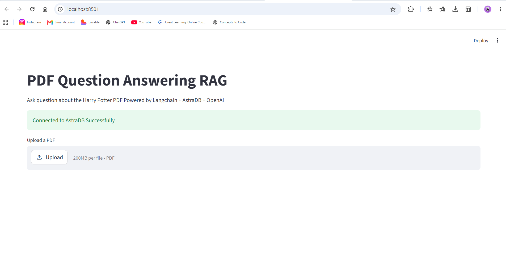
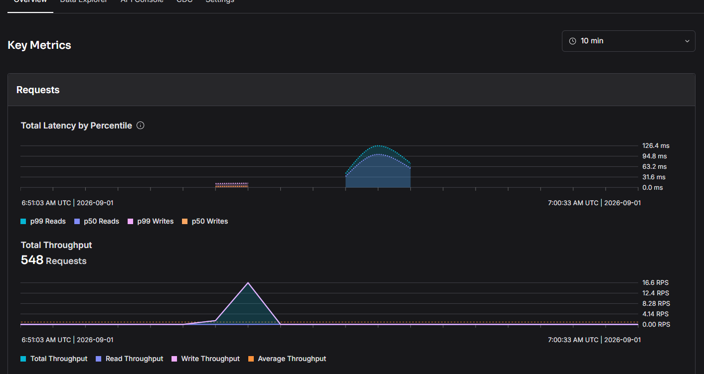
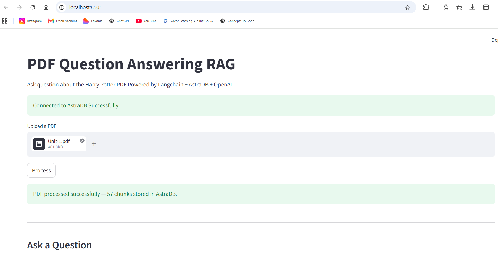
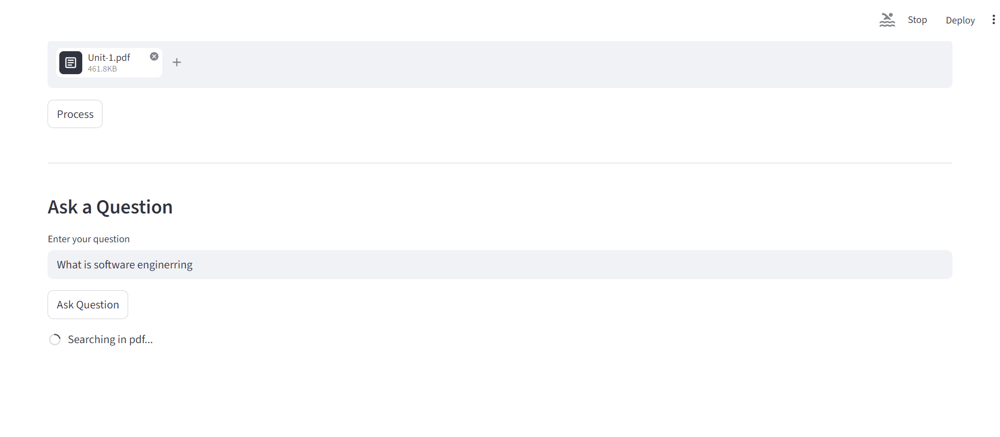
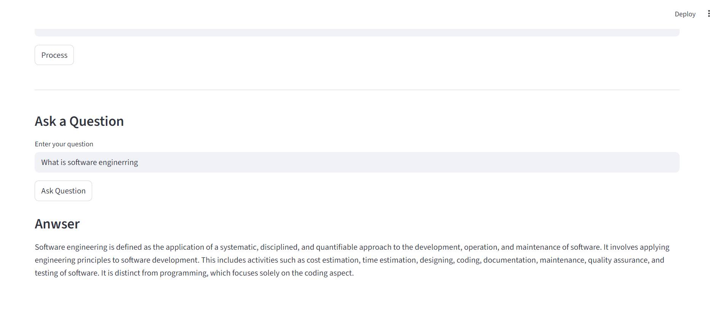

# PDF Query RAG using AstraDB

## Overview

This project implements a PDF Question Answering
RAG application using:

- Python
- Streamlit
- LangChain
- AstraDB
- OpenAI Embeddings
- OpenAI LLM

## Images

1. Homepage 
   
2. Database 
   
3. Pdf Processed 
   
4. Searching in Vector Store 
   
5. Result 
   

## Architecture

PDF
↓
PDF Loader
↓
Text Splitter
↓
Embeddings
↓
AstraDB
↓
Retriever
↓
LLM
↓
Answer

## Features

- Upload PDF
- Split PDF into chunks
- Generate embeddings
- Store embeddings in AstraDB
- Retrieve relevant PDF chunks
- Generate grounded answers
- Handle out-of-context questions
- Streamlit session state

## How To Run
1. Unzip the folder
2. Checkout to folder: `GenAI-Assignment-37-Arun-Jawlia`
3. install all packages: `pip install -r requirements.txt`
4. Run the project `streamlit run app.py`
5. Open the local URL in your browser: ` http://localhost:8501`